# Perancangan Sistem Informasi Manajemen Madrasah Aliyah Terpadu

> **Jenis dokumen:** Dokumen Perancangan Sistem (*System Design Document*)
> **Nama proyek:** Website Aliyah
> **Tipe aplikasi:** Progressive Web App (PWA), arsitektur *API-driven* (SPA + REST API)
> **Stack:** Laravel 12 (PHP 8.2+) · React 19 · Vite 6 · Tailwind CSS 4 · Laravel Sanctum · WebAuthn · Web Push

---

## Daftar Isi

1. [Pendahuluan](#1-pendahuluan)
2. [Analisis Kebutuhan](#2-analisis-kebutuhan)
3. [Perancangan Aktor dan Hak Akses](#3-perancangan-aktor-dan-hak-akses)
4. [Perancangan Arsitektur Sistem](#4-perancangan-arsitektur-sistem)
5. [Perancangan Modul dan Fitur](#5-perancangan-modul-dan-fitur)
6. [Perancangan Alur Proses (Flow)](#6-perancangan-alur-proses-flow)
7. [Perancangan Basis Data](#7-perancangan-basis-data)
8. [Perancangan API](#8-perancangan-api)
9. [Perancangan Antarmuka (UI/UX)](#9-perancangan-antarmuka-uiux)
10. [Perancangan Keamanan](#10-perancangan-keamanan)
11. [Perancangan Integrasi Eksternal](#11-perancangan-integrasi-eksternal)
12. [Perancangan Pengujian](#12-perancangan-pengujian)
13. [Perancangan Deployment](#13-perancangan-deployment)
14. [Rencana Pengembangan dan Jadwal](#14-rencana-pengembangan-dan-jadwal)
15. [Analisis Risiko dan Mitigasi](#15-analisis-risiko-dan-mitigasi)
16. [Batasan dan Rencana Pengembangan Lanjutan](#16-batasan-dan-rencana-pengembangan-lanjutan)

---

## 1. Pendahuluan

### 1.1 Latar Belakang
Pengelolaan administrasi madrasah umumnya masih tersebar di banyak media: buku absensi kertas, spreadsheet keuangan, arsip surat fisik, dan ujian berbasis kertas. Akibatnya:

- Data absensi guru, siswa, rapat, dan kegiatan sulit direkap secara akurat dan cepat.
- Perhitungan honorarium guru (*bisyaroh*) memakan waktu karena bergantung pada rekap kehadiran manual.
- Tagihan siswa, pemasukan, dan pengeluaran tidak terdokumentasi dalam satu sistem.
- Surat dan laporan dibuat berulang tanpa template dan tanpa mekanisme verifikasi keaslian.
- Pergantian tahun ajaran membutuhkan banyak kerja manual (salin kelas, jadwal, siswa).
- Ujian tertulis menyita biaya kertas dan waktu koreksi.

### 1.2 Rumusan Masalah
1. Bagaimana merancang sistem terpusat yang mengintegrasikan akademik, kehadiran, keuangan, persuratan, dan ujian?
2. Bagaimana merancang pembagian hak akses yang fleksibel untuk beragam jabatan di madrasah?
3. Bagaimana merancang sistem yang dapat diakses nyaman lewat ponsel (terutama oleh guru di lapangan)?
4. Bagaimana menjamin keamanan data dan keaslian dokumen yang dicetak?

### 1.3 Tujuan
| No | Tujuan | Indikator keberhasilan |
|----|--------|------------------------|
| 1 | Digitalisasi absensi (mengajar, siswa, kegiatan, rapat) | Absensi guru dilakukan < 1 menit, tanpa kertas |
| 2 | Otomatisasi perhitungan bisyaroh | Rekap bulanan dihasilkan otomatis dari data absensi |
| 3 | Pencatatan keuangan terpadu | Tagihan, pemasukan, pengeluaran terekam beserta bukti foto |
| 4 | Ujian CBT internal | Ujian dapat dibuat, dikerjakan, dan dinilai tanpa kertas |
| 5 | Persuratan terotomatisasi | Surat dibuat dari template dan dapat diverifikasi lewat QR |
| 6 | Akses mobile-first | Aplikasi dapat di-install (PWA) dan menerima notifikasi push |

### 1.4 Ruang Lingkup
**Termasuk dalam sistem:** manajemen data induk, jadwal, kalender akademik, absensi 4 jenis, jurnal mengajar, modul ajar, ulangan/penilaian, supervisi, keuangan (tagihan, pembayaran, pemasukan, pengeluaran, bisyaroh), persuratan, CBT, galeri, log aktivitas, notifikasi push, integrasi WhatsApp, dan asisten AI.

**Tidak termasuk (di luar lingkup versi ini):** aplikasi native Android/iOS, portal orang tua, rapor lengkap (kurikulum), payment gateway otomatis, dan integrasi langsung ke EMIS/Dapodik.

---

## 2. Analisis Kebutuhan

### 2.1 Kebutuhan Fungsional

| ID | Kebutuhan | Prioritas |
|----|-----------|-----------|
| FR-01 | Autentikasi dengan username + password, serta login biometrik (WebAuthn) | Tinggi |
| FR-02 | Manajemen pengguna, peran (*role*), dan pembatasan halaman per peran | Tinggi |
| FR-03 | Manajemen data induk: tahun ajaran, kelas, mapel, guru, siswa, ekskul, jam pelajaran | Tinggi |
| FR-04 | Penyusunan jadwal pelajaran dan kegiatan rutin | Tinggi |
| FR-05 | Kalender akademik (hari libur, kegiatan, ujian) | Sedang |
| FR-06 | Absensi mengajar guru (dengan foto bukti & snapshot jadwal) | Tinggi |
| FR-07 | Absensi siswa harian (hadir, izin, sakit, alpha) | Tinggi |
| FR-08 | Absensi kegiatan dan rapat (peserta internal & eksternal) | Sedang |
| FR-09 | Absensi berbasis token/QR berwaktu | Sedang |
| FR-10 | Jurnal mengajar & cetak jurnal per guru/kelas | Tinggi |
| FR-11 | Modul ajar (unggah/ketik, dukung .docx & PDF) | Sedang |
| FR-12 | Input ulangan dan nilai siswa | Tinggi |
| FR-13 | Supervisi guru dengan instrumen pertanyaan dinamis | Sedang |
| FR-14 | Tagihan siswa, pembayaran, dan nota | Tinggi |
| FR-15 | Pemasukan & pengeluaran dengan kategori dan bukti foto | Tinggi |
| FR-16 | Bisyaroh: pengaturan tarif, perhitungan, dan riwayat | Tinggi |
| FR-17 | Surat masuk, surat keluar, template surat, verifikasi dokumen publik | Sedang |
| FR-18 | CBT: bank soal, ujian, soal massal, proktor, pengerjaan siswa | Tinggi |
| FR-19 | Wizard pergantian tahun ajaran | Tinggi |
| FR-20 | Ekspor tabel ke Excel/PDF/Word dan cetak massal | Tinggi |
| FR-21 | Log aktivitas seluruh pengguna | Sedang |
| FR-22 | Notifikasi push dan pengiriman pesan WhatsApp | Sedang |
| FR-23 | Dashboard statistik per peran (grafik) | Sedang |
| FR-24 | Galeri dokumentasi kegiatan | Rendah |
| FR-25 | Asisten AI untuk membantu pembuatan konten | Rendah |

### 2.2 Kebutuhan Non-Fungsional

| Kategori | Kebutuhan |
|----------|-----------|
| **Keamanan** | Hash password (bcrypt, 12 round), penguncian akun setelah 5 kali gagal login (30 menit), token API berbasis Sanctum, RBAC berlapis |
| **Kinerja** | Navigasi tanpa reload (SPA), aset di-cache Service Worker, operasi berat (ekspor/cetak massal) dapat dijalankan via antrean (*queue*) |
| **Ketersediaan** | Dapat berjalan di shared hosting (cPanel) dengan SQLite/MySQL |
| **Usability** | Mobile-first, responsif, dapat dipasang di layar utama (PWA) |
| **Maintainability** | Pemisahan controller per peran (Admin/Guru/Siswa), konvensi PSR-4, formatter Laravel Pint |
| **Auditability** | Seluruh aksi penting dicatat di `activity_logs` |
| **Portabilitas** | Ekspor data dalam format terbuka (XLSX, PDF, DOCX) |

### 2.3 Batasan Perancangan
- Backend harus berjalan di PHP 8.2 (kompatibel hosting umum).
- Frontend dibuild dengan Vite dan disajikan oleh Laravel melalui satu *view* `app` (SPA *catch-all*).
- Siswa tidak memiliki panel lengkap; akses siswa dibatasi pada kebutuhan ujian dan penilaian.

---

## 3. Perancangan Aktor dan Hak Akses

### 3.1 Daftar Aktor

| Aktor | Deskripsi | Panel |
|-------|-----------|-------|
| **Superadmin** | Pengelola penuh sistem | Admin |
| **Kepala Madrasah** | Pimpinan; memantau seluruh data, supervisi | Admin |
| **Waka Kurikulum** | Mengelola jadwal, mapel, ujian, supervisi | Admin |
| **Waka Kesiswaan** | Mengelola data siswa, ekskul, kegiatan | Admin |
| **Guru** | Pelaksana KBM, absensi, nilai, modul | Guru |
| **Siswa** | Peserta ujian CBT, melihat penilaian | Siswa |
| **Publik (tanpa login)** | Memverifikasi keaslian dokumen lewat QR | Halaman `/verify/{id}` |

### 3.2 Model Otorisasi (RBAC Dinamis)

Sistem memakai **Role-Based Access Control** berlapis:

1. **Role** disimpan di tabel `roles` dengan atribut `level` (hierarki) dan `allowed_pages` (daftar halaman yang boleh diakses).
2. Satu pengguna dapat memiliki **banyak role** (tabel pivot `role_user`).
3. **Middleware** `RoleMiddleware` memeriksa role di level rute API; middleware khusus per panel (`Admin`, `Guru`, `KepalaSekolah`) membatasi kelompok endpoint.
4. Frontend menyembunyikan menu yang tidak ada dalam `allowed_pages` (pembatasan UI), sementara backend tetap menjadi penjaga utama (pembatasan data).

### 3.3 Matriks Hak Akses (ringkas)

| Fitur | Superadmin | Kepala | Waka | Guru | Siswa |
|-------|:---:|:---:|:---:|:---:|:---:|
| Kelola pengguna & role | ✅ | ❌ | ❌ | ❌ | ❌ |
| Data induk (kelas, mapel, guru, siswa) | ✅ | 👁 | ✅* | 👁 | ❌ |
| Jadwal & kalender | ✅ | 👁 | ✅ | 👁 | ❌ |
| Absensi mengajar (input) | ✅ | ❌ | ❌ | ✅ | ❌ |
| Rekap absensi seluruh guru | ✅ | 👁 | 👁 | ❌ | ❌ |
| Keuangan (tagihan, kas, bisyaroh) | ✅ | 👁 | ❌ | 👁 (bisyaroh sendiri) | ❌ |
| Persuratan | ✅ | 👁 | ✅ | ❌ | ❌ |
| Supervisi | ✅ | ✅ | ✅ | 👁 (hasil sendiri) | ❌ |
| Bank soal & ujian CBT | ✅ | ❌ | ✅ | ✅ | ❌ |
| Mengerjakan ujian CBT | ❌ | ❌ | ❌ | ❌ | ✅ |
| Log aktivitas | ✅ | 👁 | ❌ | 👁 (milik sendiri) | ❌ |

> Keterangan: ✅ penuh · 👁 hanya lihat · ❌ tidak ada akses · \* sesuai wewenang waka.

---

## 4. Perancangan Arsitektur Sistem

### 4.1 Gaya Arsitektur
**Client–Server dengan pemisahan tegas** antara lapisan presentasi (React SPA) dan lapisan layanan (Laravel REST API), dikemas dalam satu repositori monolitik (*monorepo*) agar deployment sederhana.

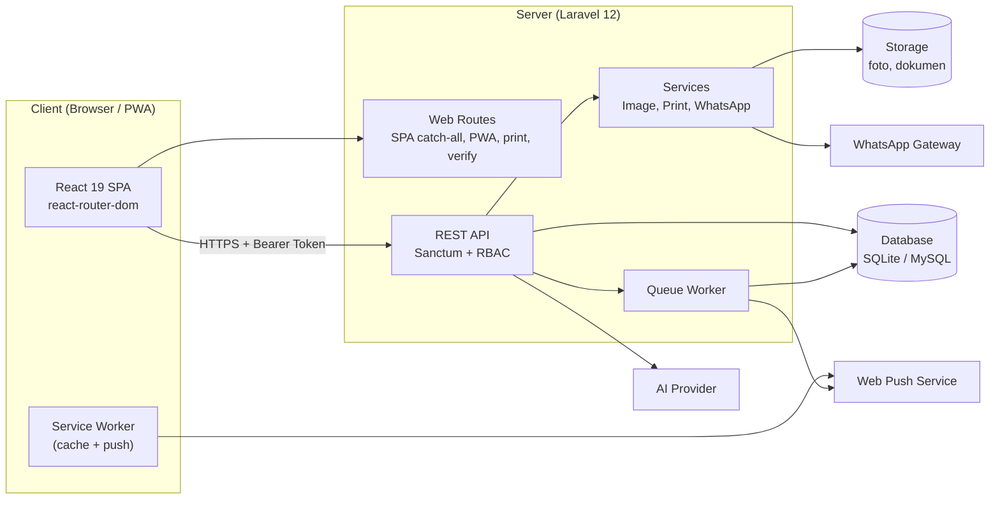

### 4.2 Arsitektur Berlapis Backend

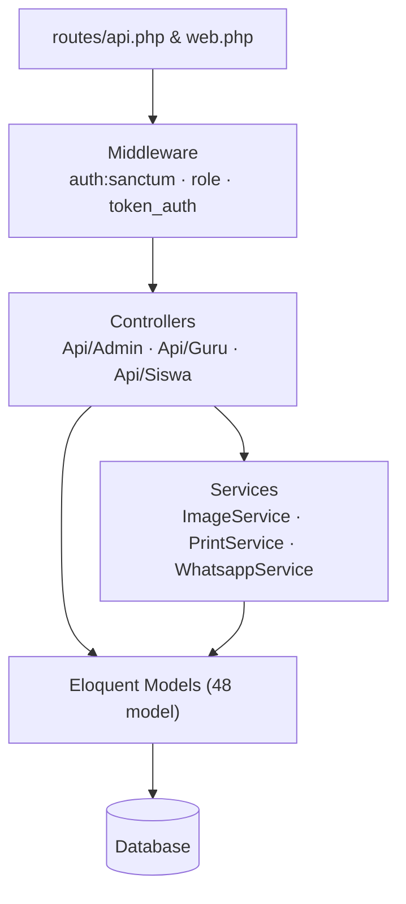

| Lapisan | Tanggung jawab | Lokasi |
|---------|----------------|--------|
| Routing | Pemetaan URL ke controller, pengelompokan middleware | `routes/` |
| Middleware | Autentikasi token, otorisasi role, autentikasi token via query untuk cetak | `app/Http/Middleware/` |
| Controller | Validasi input, orkestrasi proses, format respons JSON | `app/Http/Controllers/Api/{Admin,Guru,Siswa}` |
| Service | Logika reusable: pemrosesan gambar, render PDF, kirim WhatsApp | `app/Services/` |
| Model | Representasi tabel, relasi, *scope*, *helper* bisnis | `app/Models/` |
| Migration | Versi skema database | `database/migrations/` |

### 4.3 Arsitektur Frontend

```
resources/js/
├── main.jsx            # entry point React
├── App.jsx             # definisi routing & layout per peran
├── pages/
│   ├── Auth/           # login
│   ├── Admin/          # dashboard, data induk, keuangan, CBT, pengaturan, role, log
│   ├── Guru/           # beranda, absensi, jurnal, modul, ulangan, supervisi, riwayat
│   └── Siswa/          # beranda, jadwal ujian, penilaian, CBT, profil
├── components/         # komponen UI bersama
├── contexts/           # state global (auth, tahun ajaran, tema)
├── config/             # konfigurasi (endpoint, konstanta)
├── lib/ & utils/       # helper (axios client, format tanggal, ekspor)
```

**Keputusan desain frontend**

| Aspek | Keputusan | Alasan |
|-------|-----------|--------|
| Routing | `react-router-dom` v7, rute dilindungi per peran | SPA tanpa reload, guard berdasarkan role |
| State | React Context | Cukup untuk skala aplikasi, tanpa dependensi tambahan |
| HTTP | Axios dengan interceptor token | Satu titik pengaturan header & penanganan 401 |
| Styling | Tailwind CSS 4 | Pengembangan UI cepat dan konsisten |
| Grafik | Chart.js + react-chartjs-2 | Dashboard statistik |
| Editor teks | react-quill-new | Pengeditan modul/surat/soal berformat |
| Ekspor | xlsx, mammoth | Impor/ekspor Excel dan baca DOCX |
| Notifikasi UI | SweetAlert2 | Konfirmasi & feedback pengguna |

### 4.4 Perancangan PWA
- **Manifest dinamis** (`/manifest.json`) dan **ikon dinamis** (`/pwa-icon/{size}`) dibangkitkan server sehingga nama/logo madrasah dapat diubah dari pengaturan.
- **Service Worker** (`/sw.js`) melayani cache aset statis dan menerima *push event*.
- Header `Service-Worker-Allowed: /` agar cakupan SW meliputi seluruh aplikasi.

---

## 5. Perancangan Modul dan Fitur

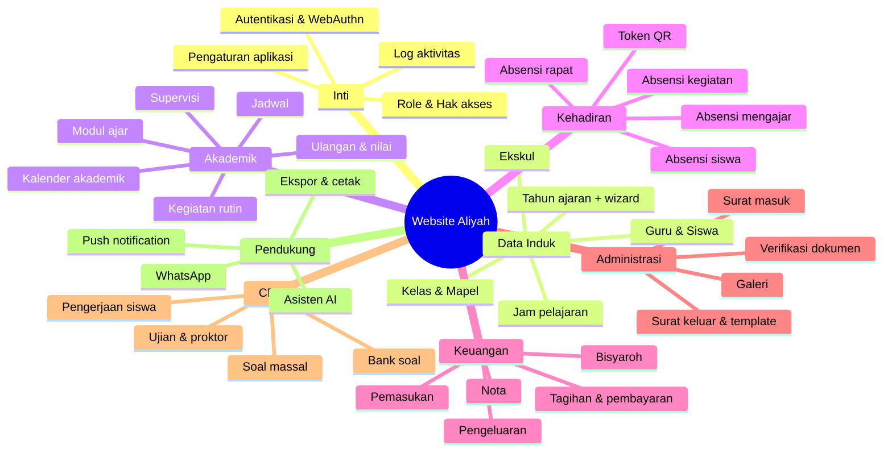

### 5.1 Modul Autentikasi & Keamanan Akun
| Fungsi | Rancangan |
|--------|-----------|
| Login admin/guru | `username` + `password` → server menerbitkan token Sanctum |
| Login siswa | Autentikasi terpisah (`Siswa/AuthController`, `CbtAuthController`) dengan password siswa |
| Login biometrik | WebAuthn (sidik jari/Face ID/PIN perangkat); kredensial dapat diaktif/nonaktifkan (`is_enabled`) |
| Proteksi brute force | Hitung `failed_login_attempts`; kunci akun 30 menit setelah 5 kali gagal (`locked_until`) |
| Preferensi tahun ajaran | Tiap pengguna menyimpan `tahun_ajaran_id` aktifnya |

### 5.2 Modul Data Induk
- **Tahun Ajaran:** satu tahun aktif; seluruh entitas utama (kelas, siswa, jadwal, kegiatan, rapat, kalender, ekskul) membawa `tahun_ajaran_id`.
- **Wizard Tahun Ajaran:** proses bertahap untuk membuat tahun baru, menyalin kelas, memindahkan/menaikkan siswa (`siswa_kelas` menyimpan riwayat), dan menandai status siswa (aktif, alumni, mutasi).
- **Guru:** profil, foto, tanda tangan digital, inisial, jabatan (`guru_jabatan`), dan akun terkait.
- **Siswa:** data pribadi, nama orang tua, status, dan password untuk akses CBT.
- **Mapel:** ada penanda `is_non_akademik` untuk mapel non-KBM.
- **Jam pelajaran:** slot waktu yang menjadi dasar jadwal (jam mulai–sampai).

### 5.3 Modul Akademik
| Submodul | Rancangan |
|----------|-----------|
| **Jadwal** | Jadwal per kelas/guru/hari dengan rentang `jam_pelajaran` (mulai–sampai); guru boleh kosong; dapat berasal dari kegiatan rutin |
| **Kalender** | Peristiwa tanggal-waktu dengan kategori (`keterangan`), tempat, relasi opsional ke kegiatan/guru |
| **Kegiatan Rutin** | Kegiatan berulang yang menghasilkan entri jadwal/kegiatan otomatis |
| **Modul Ajar** | Dokumen perangkat ajar per guru, tanggal, dan mapel |
| **Ulangan/Nilai** | Ulangan dibuka dari sesi mengajar; nilai tiap siswa di `nilai_siswa` |
| **Supervisi** | Instrumen pertanyaan dinamis (`supervisi_questions`), penilaian oleh supervisor atas guru |

### 5.4 Modul Kehadiran
| Jenis | Entitas | Rancangan khusus |
|-------|---------|------------------|
| Mengajar | `absensi_mengajar` | Snapshot jadwal & jumlah siswa saat input; status guru (hadir/sakit/izin/alpha/tugas); foto bukti; mendukung sesi tanpa jadwal |
| Siswa | `absensi_siswa` | Rekap **harian** per siswa, status hadir/izin/sakit/alpha, constraint unik per siswa-per-tanggal |
| Kegiatan | `absensi_kegiatan` | Peserta guru/siswa, guru pendamping |
| Rapat | `absensi_rapat` | Peserta internal & eksternal, hasil rapat, notulen |
| Token | `attendance_tokens` | Token/QR berwaktu untuk absensi mandiri |

### 5.5 Modul Keuangan

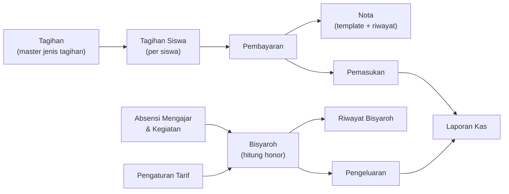

| Submodul | Rancangan |
|----------|-----------|
| Tagihan | Master tagihan dengan jatuh tempo; didistribusikan ke siswa terpilih |
| Pembayaran | Pencatatan pembayaran sebagian/lunas; status tagihan otomatis |
| Nota | Template nota dapat diatur, preset isi, dan riwayat cetak |
| Pemasukan/Pengeluaran | Kategori (`transaksi_kategori`), nominal, tanggal, bukti foto |
| Bisyaroh | Tarif per komponen (pengaturan awal ter-*seed*), kalkulasi dari kehadiran, disimpan sebagai riwayat dengan total |

### 5.6 Modul Persuratan
- **Surat Masuk:** pencatatan, tanggal surat, nomor agenda, lampiran.
- **Surat Keluar:** pembuatan dari **template** (data terstruktur disimpan di `template_data`), penomoran, ekspor DOCX/PDF.
- **Verifikasi Dokumen:** setiap dokumen resmi mendapat ID unik di `document_verifications`; QR code mengarah ke `/verify/{id}` (publik) untuk membuktikan keaslian.

### 5.7 Modul CBT (Computer Based Test)

| Entitas | Peran |
|---------|-------|
| `cbt_question_banks` | Kumpulan soal per mapel/pembuat |
| `cbt_questions` | Soal (tipe beragam, konten *longtext* berformat) |
| `cbt_exams` | Ujian: jadwal, durasi, kelas peserta, proktor, nama proyek |
| `cbt_student_exams` | Sesi pengerjaan tiap siswa (waktu mulai, selesai, skor) |
| `cbt_answers` | Jawaban per soal per sesi |

**Fitur khusus:** impor soal massal (`CbtBulkQuestionController`), penugasan proktor, jadwal ujian untuk siswa, penyimpanan jawaban bertahap agar tahan koneksi putus.

### 5.8 Modul Pendukung
| Modul | Rancangan |
|-------|-----------|
| **Dashboard** | Statistik per peran (jumlah guru/siswa, kehadiran, keuangan) dengan grafik |
| **Log Aktivitas** | `activity_logs` mencatat pengguna, aksi, objek, dan waktu |
| **Pengaturan** | `app_settings` (key–value): identitas madrasah, logo, tema, konfigurasi integrasi |
| **Galeri** | Unggah dan tampilkan dokumentasi; gambar dioptimasi `ImageService` |
| **Ekspor** | `TableExportController` untuk Excel/PDF generik; `GuruPrintController` untuk cetak khusus |
| **Notifikasi** | Langganan push (`push_subscriptions`) + pesan WhatsApp |
| **Asisten AI** | Endpoint `AiController` membantu membuat/merapikan konten (mis. modul/surat) |

---

## 6. Perancangan Alur Proses (Flow)

### 6.1 Alur Login (password & biometrik)

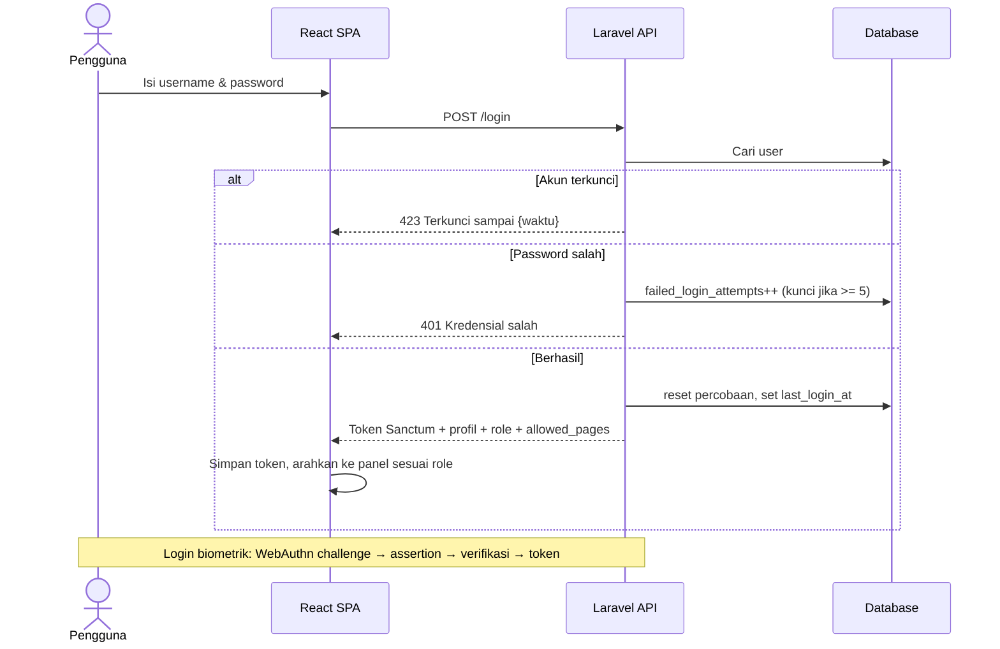

### 6.2 Alur Absensi Mengajar oleh Guru

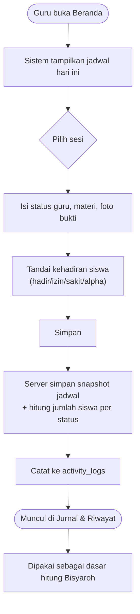

### 6.3 Alur Perhitungan Bisyaroh

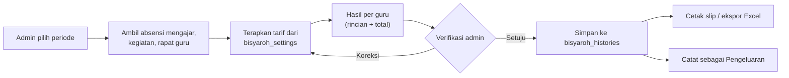

### 6.4 Alur Pelaksanaan Ujian CBT

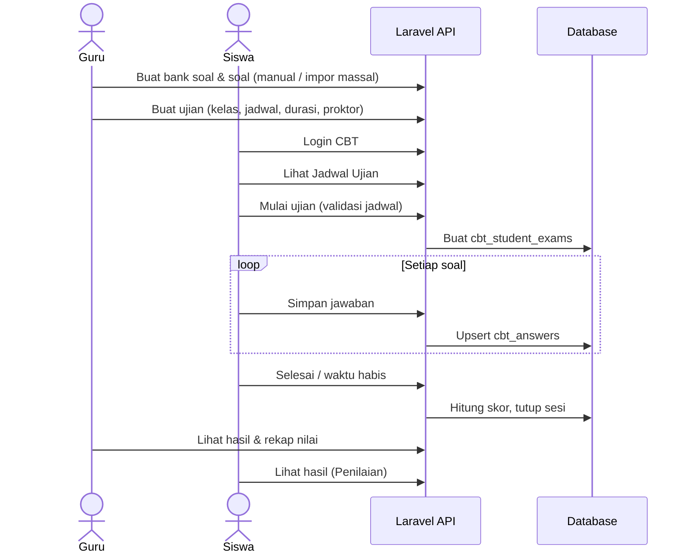

### 6.5 Alur Pergantian Tahun Ajaran

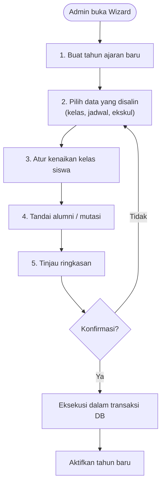

### 6.6 Alur Pembuatan & Verifikasi Dokumen

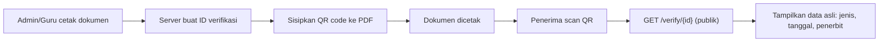

---

## 7. Perancangan Basis Data

### 7.1 Prinsip Perancangan
1. **Normalisasi hingga 3NF** untuk data master; denormalisasi terkontrol (snapshot) pada tabel absensi agar riwayat tidak berubah ketika jadwal diedit.
2. **Pemisahan per tahun ajaran** melalui kolom `tahun_ajaran_id`.
3. **Soft-history:** riwayat penempatan siswa di `siswa_kelas`, riwayat bisyaroh di `bisyaroh_histories`.
4. **Integritas:** foreign key, constraint unik (mis. absensi siswa harian), enum status.
5. **Basis data netral:** SQLite untuk pengembangan, MySQL untuk produksi.

### 7.2 ERD Inti

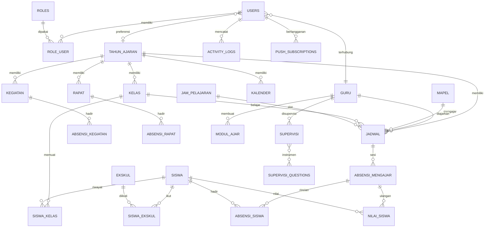

### 7.3 ERD Keuangan

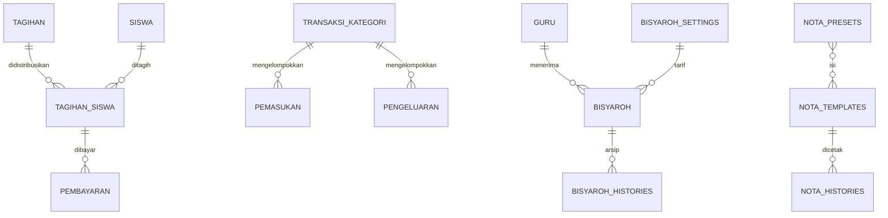

### 7.4 ERD CBT & Persuratan

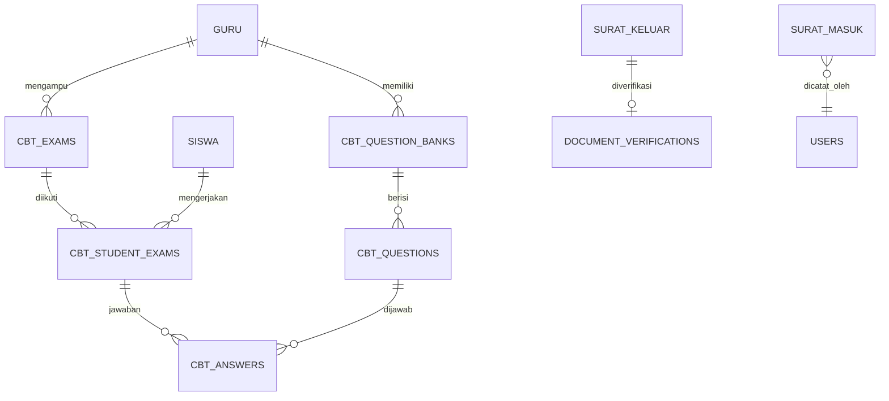

### 7.5 Kamus Data Entitas Utama (ringkas)

| Tabel | Kolom kunci | Keterangan |
|-------|-------------|------------|
| `users` | id, username (unik), name, password, role, guru_id, tahun_ajaran_id, is_active, failed_login_attempts, locked_until, last_login_at | Akun admin/guru |
| `roles` | id, name, level, allowed_pages | Role dinamis |
| `tahun_ajaran` | id, nama, semester, tanggal_mulai/selesai, is_active | Periode akademik |
| `guru` | id, nama, email, foto, ttd, inisial, user_id | Profil guru |
| `siswa` | id, nama, status (aktif/alumni/mutasi), nama_ayah/ibu, password, tahun_ajaran_id | Profil siswa |
| `kelas` | id, nama, tahun_ajaran_id, wali | Rombel |
| `jadwal` | id, kelas_id, mapel_id, guru_id (nullable), hari, jam_pelajaran_id, jam_pelajaran_sampai_id, is_kegiatan_rutin | Jadwal |
| `absensi_mengajar` | id, jadwal_id (nullable), tanggal, guru_status, foto, snapshot jadwal, jumlah siswa per status | Sesi mengajar |
| `absensi_siswa` | id, siswa_id, tanggal, status (hadir/izin/sakit/alpha) — **unik (siswa, tanggal)** | Absensi harian |
| `bisyaroh_histories` | id, guru_id, periode, rincian, total_jumlah | Arsip honor |
| `document_verifications` | id (uuid), jenis, referensi, data | Verifikasi QR |
| `cbt_exams` | id, judul, jadwal, durasi, proctor_ids, project_name | Ujian |

> Struktur kolom lengkap mengikuti 119 berkas migrasi pada `database/migrations/`.

### 7.6 Strategi Data
- **Migrasi bertahap:** setiap perubahan skema dibuat sebagai migrasi baru (tidak mengubah migrasi lama).
- **Seeder bawaan:** pengaturan bisyaroh awal, role dasar, dan instrumen supervisi.
- **Indeks yang direncanakan:** `(tahun_ajaran_id, kelas_id)`, `(siswa_id, tanggal)`, `(guru_id, tanggal)`, `(cbt_exam_id, siswa_id)`.
- **Cadangan:** dump terjadwal harian + salinan folder `storage/app`.

---

## 8. Perancangan API

### 8.1 Konvensi
| Aspek | Aturan |
|-------|--------|
| Gaya | REST, JSON |
| Autentikasi | `Authorization: Bearer <token>` (Sanctum) |
| Penamaan | Sumber daya jamak/huruf kecil, mis. `/api/admin/kelas` |
| Metode | `GET` baca · `POST` buat · `PUT/PATCH` ubah · `DELETE` hapus |
| Format sukses | `{ "success": true, "data": ..., "message": "..." }` |
| Format gagal | `{ "success": false, "message": "...", "errors": {...} }` |
| Kode status | 200, 201, 401, 403, 404, 422 (validasi), 423 (akun terkunci), 500 |
| Paginasi | `?page=&per_page=` dengan metadata |
| Filter | `?tahun_ajaran_id=&kelas_id=&search=` |

### 8.2 Pengelompokan Endpoint

| Grup | Awalan | Controller utama |
|------|--------|------------------|
| Autentikasi | `/api/login`, `/api/logout`, `/api/me` | `AuthController`, `WebAuthnController` |
| Admin | `/api/admin/*` | `Api/Admin/*` (36 controller) |
| Guru | `/api/guru/*` | `Api/Guru/*` (16 controller) |
| Siswa/CBT | `/api/siswa/*` | `Api/Siswa/*` (5 controller) |
| Absensi token | `/api/attendance-token/*` | `AttendanceTokenController` |
| Tahun ajaran | `/api/tahun-ajaran/*` | `TahunAjaranController` |
| Cetak | `/print/*` (web, token pada query) | `GuruPrintController` |
| Publik | `/verify/{id}`, `/manifest.json`, `/sw.js` | `VerificationController`, `ManifestController` |

### 8.3 Contoh Kontrak Endpoint

**Login**
```http
POST /api/login
Content-Type: application/json

{ "username": "guru01", "password": "••••••••" }
```
```json
{
  "success": true,
  "data": {
    "token": "1|abc...",
    "user": { "id": 3, "name": "Ahmad", "roles": ["guru"], "allowed_pages": ["beranda", "absensi"] }
  }
}
```

**Simpan absensi mengajar**
```http
POST /api/guru/absensi-mengajar
Authorization: Bearer <token>

{
  "jadwal_id": 12,
  "tanggal": "2026-10-05",
  "guru_status": "hadir",
  "materi": "Bab 3",
  "siswa": [ { "siswa_id": 1, "status": "hadir" }, { "siswa_id": 2, "status": "sakit" } ]
}
```

**Mulai ujian CBT**
```http
POST /api/siswa/cbt/exams/{id}/start
Authorization: Bearer <token-siswa>
```

### 8.4 Pencetakan Massal (Bulk Print)
Endpoint `GET /print/*-bulk` menerima parameter rentang tanggal/kelas, dipanggil dari tab baru sehingga token dikirim lewat *query string* dan divalidasi oleh middleware `token_auth`. Token cetak bersifat sementara dan hanya berlaku untuk rute cetak.

---

## 9. Perancangan Antarmuka (UI/UX)

### 9.1 Prinsip Desain
1. **Mobile-first**: guru memakai ponsel; tata letak utama satu kolom dengan *bottom navigation* di panel guru dan siswa.
2. **Efisiensi tap**: aksi utama (absen) maksimal 3 langkah dari beranda.
3. **Konsistensi**: komponen tombol, kartu, tabel, modal memakai pola yang sama di semua panel.
4. **Umpan balik jelas**: loading, sukses, dan error selalu ditampilkan (SweetAlert2/toast).
5. **Aksesibilitas**: kontras warna memadai, ukuran sentuh ≥ 44px.

### 9.2 Peta Navigasi (Sitemap)

```mermaid
flowchart TD
    L["Login"] --> A["Panel Admin"]
    L --> G["Panel Guru"]
    L --> S["Panel Siswa"]

    A --> A1["Dashboard"]
    A --> A2["Data Induk<br/>(guru, siswa, kelas, mapel, ekskul, jam)"]
    A --> A3["Jadwal & Kalender"]
    A --> A4["Absensi & Rekap"]
    A --> A5["Keuangan<br/>(Transaksi, Bisyaroh, Nota)"]
    A --> A6["Persuratan"]
    A --> A7["CBT"]
    A --> A8["Supervisi"]
    A --> A9["Manajemen Role & Log Aktivitas"]
    A --> A10["Pengaturan & Galeri"]

    G --> G1["Beranda (jadwal hari ini)"]
    G --> G2["Absensi: Mengajar · Kelas · Kegiatan · Rapat"]
    G --> G3["Jurnal Kelas & Riwayat"]
    G --> G4["Modul Ajar & Ulangan"]
    G --> G5["Supervisi & Kaldik"]
    G --> G6["CBT (bank soal, ujian)"]
    G --> G7["Profil & Pengaturan"]

    S --> S1["Beranda"]
    S --> S2["Jadwal Ujian"]
    S --> S3["Ujian CBT"]
    S --> S4["Penilaian"]
    S --> S5["Profil"]
```

### 9.3 Rancangan Layout

| Panel | Layout | Komponen utama |
|-------|--------|----------------|
| Admin (desktop) | Sidebar kiri + header + konten | Tabel data dengan pencarian/filter/paginasi, modal form, kartu statistik, grafik |
| Guru (mobile) | Header + konten + bottom nav | Kartu jadwal hari ini, tombol aksi cepat, daftar siswa dengan toggle status |
| Siswa (mobile) | Header ringkas + konten | Daftar ujian, halaman soal dengan navigasi nomor, timer |

### 9.4 Rancangan Halaman Kunci

**Beranda Guru**
- Sapaan + tahun ajaran aktif
- Kartu "Jadwal Hari Ini" (status: belum/sudah absen)
- Akses cepat: Absensi, Jurnal, Modul, Ulangan
- Ringkasan kehadiran bulan ini

**Halaman Pengerjaan CBT**
- Header: judul ujian + timer hitung mundur
- Area soal (mendukung teks berformat/gambar)
- Panel nomor soal (terjawab / ragu / belum)
- Tombol Sebelumnya · Ragu-ragu · Berikutnya · Selesai

**Dashboard Admin**
- Kartu: jumlah guru, siswa, kelas, kehadiran hari ini
- Grafik tren kehadiran & keuangan bulanan
- Daftar aktivitas terbaru

### 9.5 Panduan Visual
- **Tipografi:** font sans-serif modern (mis. Inter/Poppins), hierarki H1–H3 jelas.
- **Warna:** palet utama bernuansa hijau/teal (identitas madrasah), warna semantik—hijau sukses, kuning peringatan, merah bahaya—diatur lewat token Tailwind.
- **Mode tema:** disiapkan dukungan tema terang/gelap melalui konteks tema.
- **Mikro-interaksi:** transisi halus, *skeleton loading*, umpan balik tombol.

### 9.6 State UI yang Wajib Dirancang
Kosong (*empty state*), memuat, galat, tidak ada izin, offline, dan sesi kedaluwarsa (otomatis diarahkan ke login).

---

## 10. Perancangan Keamanan

| Ancaman | Kontrol yang dirancang |
|---------|------------------------|
| Pencurian kredensial | Hash bcrypt; WebAuthn sebagai alternatif tanpa password |
| Brute force | Kunci akun 30 menit setelah 5 gagal; log percobaan |
| Akses tidak sah | Sanctum token + `RoleMiddleware` + middleware per panel |
| Eskalasi hak (IDOR) | Setiap query guru difilter `guru_id` pengguna login; admin dibatasi role |
| Injeksi SQL | Eloquent/Query Builder dengan parameter terikat |
| XSS | Escape output React; sanitasi konten Quill sebelum ditampilkan |
| CSRF | API berbasis token Bearer (tanpa cookie sesi untuk API) |
| Upload berbahaya | Validasi mime/ukuran, pemrosesan ulang gambar (`ImageService`), penyimpanan di luar *public* untuk dokumen sensitif |
| Pemalsuan dokumen | QR verifikasi publik berbasis ID tak teratur |
| Kebocoran token cetak | Token cetak berumur pendek dan terbatas pada rute `/print` |
| Penyalahgunaan CBT | Validasi jadwal & durasi di server, satu sesi aktif per siswa, jawaban disimpan server-side |
| Jejak audit | `activity_logs` untuk aksi sensitif (login, ubah nilai, hapus data, transaksi) |
| Kebocoran konfigurasi | `.env` di luar VCS, `APP_DEBUG=false` di produksi |

---

## 11. Perancangan Integrasi Eksternal

| Integrasi | Tujuan | Rancangan |
|-----------|--------|-----------|
| **WhatsApp** | Kirim notifikasi/pengingat (tagihan, absensi, info) | `WhatsappService` + `WhatsappController`; token/URL gateway di `app_settings`; pengiriman lewat antrean agar tidak memblok request |
| **Web Push** | Notifikasi langsung ke perangkat | Pustaka `minishlink/web-push`; kunci VAPID; langganan disimpan di `push_subscriptions` |
| **AI Provider** | Bantuan pembuatan konten | `AiController` memanggil API pihak ketiga; kunci API di environment; pembatasan penggunaan per pengguna |
| **QR Code** | Verifikasi dokumen & token absen | `simple-qrcode` |
| **PDF/Word/Excel** | Laporan & surat | `dompdf`, `phpword`, `phpspreadsheet`, `smalot/pdfparser` (baca PDF) |

---

## 12. Perancangan Pengujian

### 12.1 Strategi
| Level | Alat | Cakupan |
|-------|------|---------|
| Unit | PHPUnit 11 | Perhitungan bisyaroh, aturan penguncian akun, helper role |
| Fitur/API | PHPUnit + `RefreshDatabase` | Endpoint autentikasi, absensi, keuangan, CBT |
| Manual/UAT | Skenario per peran | Alur kerja nyata bersama pengguna |
| Kompatibilitas | Browser & perangkat | Chrome, Edge, Firefox, Safari iOS, Android Chrome |
| Keamanan | Checklist OWASP Top 10 | Autentikasi, otorisasi, upload, injeksi |

### 12.2 Contoh Kasus Uji

| ID | Skenario | Hasil diharapkan |
|----|----------|------------------|
| TC-01 | Login dengan kredensial benar | Token diterbitkan, diarahkan ke panel sesuai role |
| TC-02 | Login salah 5 kali berturut-turut | Akun terkunci 30 menit |
| TC-03 | Guru mengakses endpoint admin | 403 Forbidden |
| TC-04 | Guru menyimpan absensi dua kali pada sesi yang sama | Ditolak/ditimpa sesuai aturan unik |
| TC-05 | Absensi siswa duplikat (siswa+tanggal sama) | Ditolak oleh constraint unik |
| TC-06 | Siswa memulai ujian di luar jadwal | Ditolak dengan pesan jelas |
| TC-07 | Jaringan putus saat ujian, lalu tersambung | Jawaban yang tersimpan tetap utuh |
| TC-08 | Verifikasi ID dokumen tidak valid | Halaman "dokumen tidak ditemukan" |
| TC-09 | Wizard tahun ajaran gagal di tengah | Seluruh perubahan di-*rollback* |
| TC-10 | Cetak massal 200 siswa | Selesai tanpa timeout / berjalan via antrean |

### 12.3 Kriteria Penerimaan
Semua kebutuhan prioritas **Tinggi** lulus UAT, tidak ada cacat kritis terbuka, dan alur absensi → jurnal → bisyaroh berjalan end-to-end dengan data uji.

---

## 13. Perancangan Deployment

### 13.1 Lingkungan
| Lingkungan | Database | Tujuan |
|------------|----------|--------|
| Lokal (dev) | SQLite | Pengembangan; `composer dev` menjalankan server, queue, log, dan Vite bersamaan |
| Staging | MySQL | UAT dengan data contoh |
| Produksi | MySQL | Penggunaan nyata, HTTPS wajib |

### 13.2 Topologi Produksi

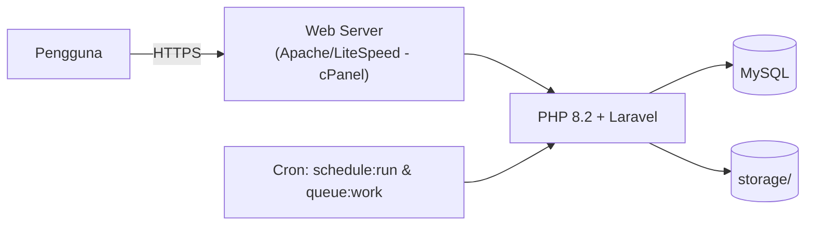

### 13.3 Proses Rilis
1. Push ke repositori (cabang `main`).
2. Build aset: `npm ci && npm run build`.
3. `composer install --no-dev --optimize-autoloader`.
4. `php artisan migrate --force`.
5. Cache konfigurasi: `config:cache`, `route:cache`, `view:cache`.
6. Pastikan izin tulis pada `storage/` dan `bootstrap/cache/`.
7. Berkas `.cpanel.yml` & `deploy.sh` mengotomatiskan langkah di atas pada hosting cPanel.

### 13.4 Konfigurasi Penting Produksi
`APP_ENV=production`, `APP_DEBUG=false`, `APP_URL` HTTPS, `DB_*` MySQL, `QUEUE_CONNECTION=database`, kunci VAPID, kredensial WhatsApp, dan kunci AI.

### 13.5 Operasional
- **Backup:** dump DB harian + `storage/app` mingguan.
- **Monitoring:** `laravel/pail` untuk log; peninjauan `activity_logs`.
- **Rencana pemulihan:** pulihkan dump terakhir, jalankan migrasi, verifikasi alur login & absensi.

---

## 14. Rencana Pengembangan dan Jadwal

Metodologi: **iteratif-inkremental (Agile ringan)**, rilis per iterasi 2 minggu.

| Fase | Durasi | Keluaran |
|------|--------|----------|
| **0. Inisiasi** | Minggu 1 | Analisis kebutuhan, wawancara pengguna, dokumen perancangan ini |
| **1. Fondasi** | Minggu 2–3 | Skeleton Laravel + React, autentikasi, role, tahun ajaran, log aktivitas |
| **2. Data induk** | Minggu 4–5 | CRUD guru, siswa, kelas, mapel, jam pelajaran, ekskul, impor Excel |
| **3. Akademik & kehadiran** | Minggu 6–9 | Jadwal, kalender, 4 jenis absensi, jurnal, token QR |
| **4. Penilaian & modul** | Minggu 10–11 | Ulangan/nilai, modul ajar, supervisi |
| **5. Keuangan** | Minggu 12–14 | Tagihan, pembayaran, nota, kas, bisyaroh |
| **6. Persuratan & verifikasi** | Minggu 15–16 | Surat masuk/keluar, template, QR verifikasi |
| **7. CBT** | Minggu 17–19 | Bank soal, ujian, pengerjaan siswa, hasil |
| **8. PWA & notifikasi** | Minggu 20–21 | Manifest, Service Worker, push, WhatsApp |
| **9. Pengujian & UAT** | Minggu 22–23 | Uji fungsional, keamanan, perbaikan |
| **10. Deployment & pelatihan** | Minggu 24 | Rilis produksi, pelatihan pengguna, serah terima |

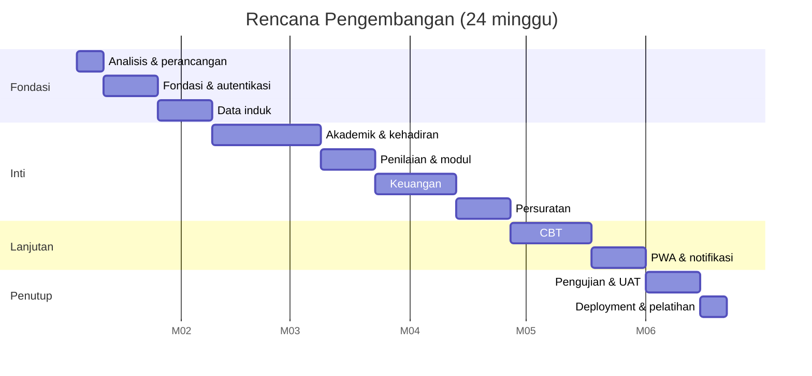

### 14.1 Pembagian Peran Tim (usulan)
| Peran | Tanggung jawab |
|-------|----------------|
| Product owner (pihak madrasah) | Prioritas fitur, validasi hasil |
| System analyst / perancang | Dokumen perancangan, alur proses |
| Backend developer | API, basis data, keamanan |
| Frontend developer | UI React, PWA |
| QA | Skenario uji, UAT |

---

## 15. Analisis Risiko dan Mitigasi

| No | Risiko | Dampak | Kemungkinan | Mitigasi |
|----|--------|--------|:-----------:|----------|
| 1 | Pengguna (guru) sulit beradaptasi | Tinggi | Sedang | UI sederhana, panduan singkat, pelatihan, pendampingan awal |
| 2 | Koneksi internet tidak stabil saat absensi/ujian | Tinggi | Tinggi | Simpan jawaban bertahap, cache PWA, retry otomatis |
| 3 | Kebocoran data pribadi siswa/guru | Tinggi | Rendah | RBAC, HTTPS, log audit, minimalkan data yang ditampilkan |
| 4 | Beban server saat ujian serentak | Sedang | Sedang | Query ringan, indeks, antrean, batasi ukuran gambar soal |
| 5 | Kesalahan perhitungan bisyaroh | Tinggi | Sedang | Uji unit rumus, langkah verifikasi admin sebelum simpan, riwayat tak dapat diubah diam-diam |
| 6 | Kegagalan migrasi tahun ajaran | Tinggi | Rendah | Eksekusi dalam transaksi, backup sebelum wizard, pratinjau ringkasan |
| 7 | Ketergantungan layanan pihak ketiga (WhatsApp/AI) | Sedang | Sedang | Antrean + retry, fitur utama tidak bergantung pada integrasi |
| 8 | Perubahan kebutuhan di tengah proyek | Sedang | Tinggi | Iterasi pendek, daftar prioritas (backlog) terkelola |
| 9 | Hosting terbatas (shared hosting) | Sedang | Sedang | Hindari dependensi berat, dukung SQLite/MySQL, cron sebagai pengganti daemon |

---

## 16. Batasan dan Rencana Pengembangan Lanjutan

### 16.1 Batasan Versi Saat Ini
- Panel siswa difokuskan pada CBT dan penilaian; belum ada portal tagihan/absensi untuk siswa atau orang tua.
- Pembayaran dicatat manual (belum memakai *payment gateway*).
- Belum ada mode offline penuh (hanya cache aset dan penyimpanan jawaban bertahap).
- Cetak sangat besar masih bergantung pada kapasitas hosting.

### 16.2 Pengembangan Lanjutan (Roadmap)
1. Portal orang tua (lihat absensi, nilai, tagihan, notifikasi WhatsApp otomatis).
2. Integrasi *payment gateway* / virtual account untuk pembayaran tagihan.
3. Modul rapor & penilaian kurikulum lengkap.
4. Anti-kecurangan CBT lanjutan (deteksi pindah tab, acak soal/opsi, kamera proktor).
5. Analitik prediktif (mis. peringatan dini siswa sering alpha).
6. Mode offline-first penuh dengan sinkronisasi latar belakang.
7. Ekspor/sinkronisasi ke sistem pemerintah (EMIS/Dapodik).
8. Aplikasi mobile native bila kebutuhan melampaui kemampuan PWA.

---

## Lampiran

### A. Glosarium
| Istilah | Arti |
|---------|------|
| **Bisyaroh** | Honorarium/insentif guru |
| **CBT** | *Computer Based Test*, ujian berbasis komputer |
| **Kaldik** | Kalender akademik |
| **Proktor** | Pengawas ujian |
| **Supervisi** | Penilaian kinerja mengajar guru oleh supervisor |
| **PWA** | *Progressive Web App*, web yang dapat di-install seperti aplikasi |
| **RBAC** | *Role-Based Access Control* |
| **SPA** | *Single Page Application* |
| **WebAuthn** | Standar autentikasi tanpa password berbasis biometrik/kunci perangkat |

### B. Struktur Repositori Rencana

```
Website-Aliyah/
├── app/
│   ├── Http/
│   │   ├── Controllers/Api/{Admin,Guru,Siswa}
│   │   └── Middleware/
│   ├── Models/            # 48 model
│   └── Services/          # Image, Print, Whatsapp
├── bootstrap/
├── config/
├── database/{migrations,seeders,factories}
├── public/                # aset build, sw.js
├── resources/
│   ├── js/                # React SPA
│   ├── css/
│   └── views/app.blade.php
├── routes/{api,web,console}.php
├── storage/
├── tests/
├── composer.json
├── package.json
└── vite.config.js
```

### C. Referensi Teknologi
- Laravel 12 — https://laravel.com/docs
- Laravel Sanctum — https://laravel.com/docs/sanctum
- React 19 — https://react.dev
- Vite — https://vite.dev
- Tailwind CSS 4 — https://tailwindcss.com
- WebAuthn (Laragear) — https://github.com/Laragear/WebAuthn
- Web Push (minishlink) — https://github.com/web-push-libs/web-push-php
